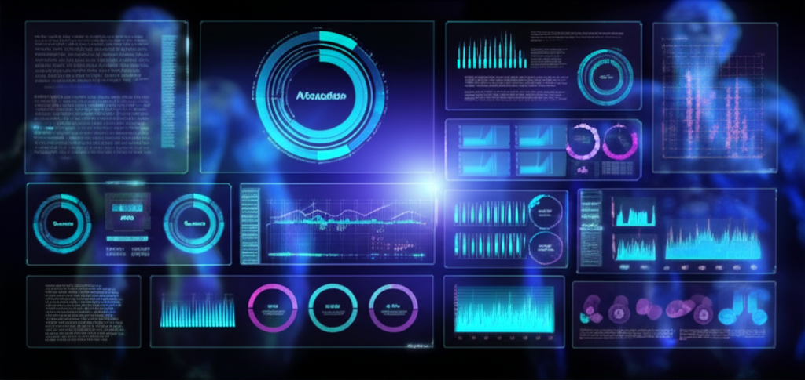
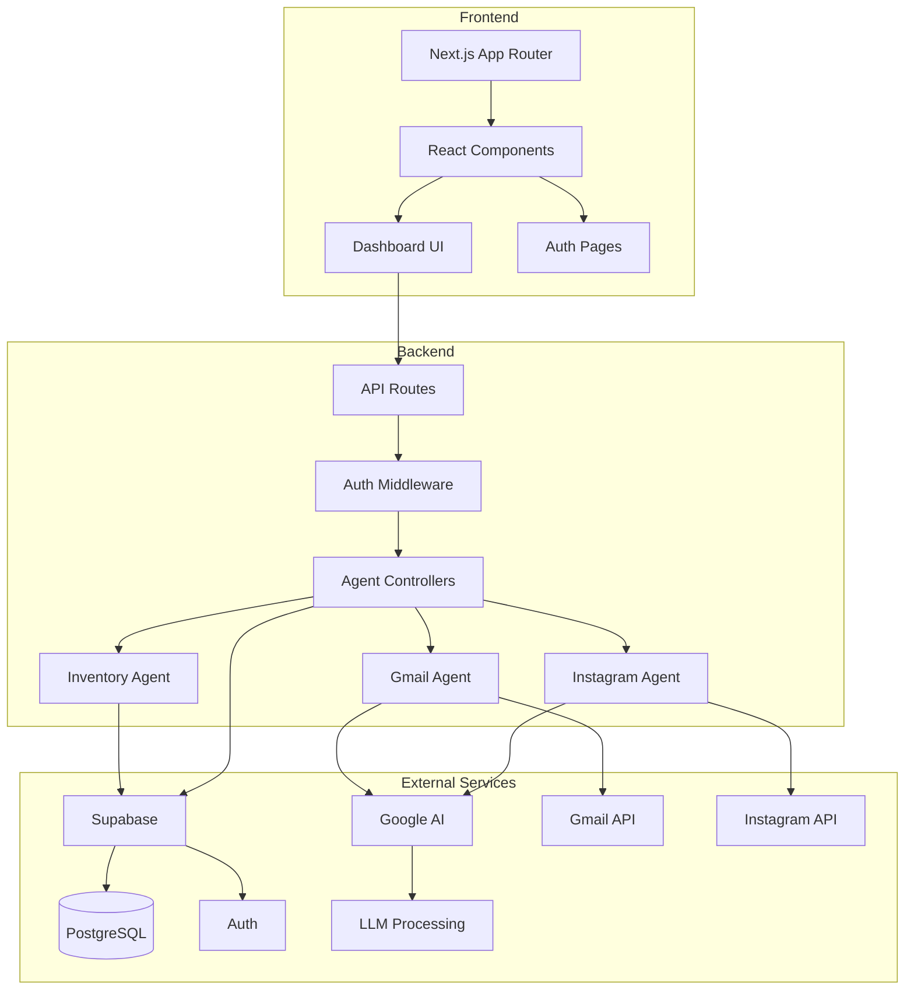
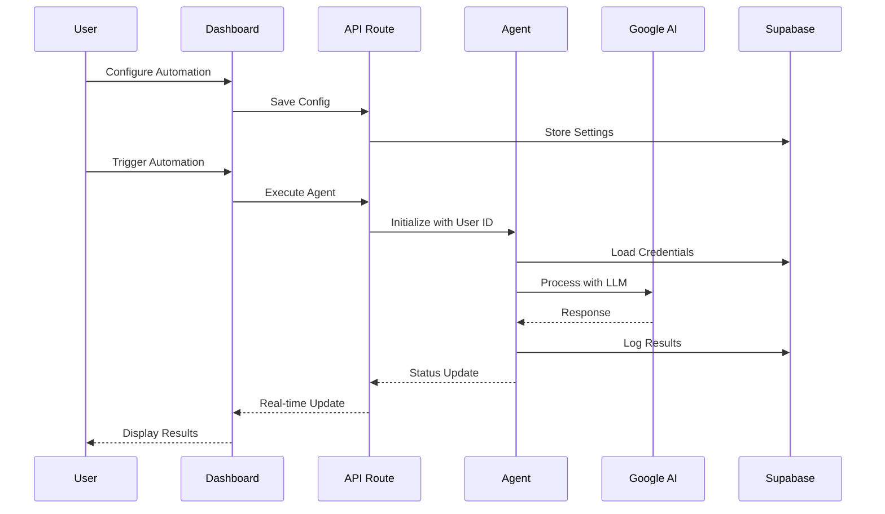

<div align="center">

# 🤖 AgenticPilot

### **AI-Powered Business Automation Platform**

*Transform your business operations with intelligent automation agents that work 24/7*

<br>

[](https://nextjs.org/)
[](https://react.dev/)
[](https://www.typescriptlang.org/)
[](https://tailwindcss.com/)
[](https://supabase.com/)

<br>

[🚀 **Get Started**](#-quick-start) · [📖 **Documentation**](#-project-structure) · [✨ **Features**](#-core-features) · [🛠️ **Tech Stack**](#️-tech-stack) · [📊 **Architecture**](#-architecture)

<br>



</div>

---

## 📋 Table of Contents

- [🎯 Overview](#-overview)
- [✨ Core Features](#-core-features)
- [🛠️ Tech Stack](#️-tech-stack)
- [📁 Project Structure](#-project-structure)
- [🚀 Quick Start](#-quick-start)
- [⚙️ Environment Setup](#️-environment-setup)
- [📊 Architecture](#-architecture)
- [🎨 UI Components](#-ui-components)
- [🔐 Security](#-security)
- [🗺️ Roadmap](#️-roadmap)
- [🤝 Contributing](#-contributing)
- [📄 License](#-license)

---

## 🎯 Overview

**AgenticPilot** is a cutting-edge SaaS automation platform designed for startups and small businesses. It leverages AI-powered agents to automate repetitive tasks across email management, social media, and inventory operations.

<table>
<tr>
<td>

### 🎯 **Target Audience**
- Startups & Small Businesses
- E-commerce Operations
- Customer Support Teams
- Marketing Professionals

</td>
<td>

### 💡 **Key Benefits**
- ⏱️ Save 20+ hours/week
- 📈 95% accuracy rate
- 🔄 24/7 automation
- 💰 40% cost reduction

</td>
</tr>
</table>

---

## ✨ Core Features

<table>
<tr>
<td width="33%" align="center">
<h3>📧 Smart Email Automation</h3>
<p><b>Gmail Integration</b></p>

- AI-powered auto-reply system
- Context-aware response generation
- Email classification (reviews/inquiries)
- Escalation for complex queries
- Custom template management
- Real-time logging & analytics

</td>
<td width="33%" align="center">
<h3>📦 Inventory Management</h3>
<p><b>Stock Control</b></p>

- Automated inventory tracking
- Smart stock alerts
- Predictive reorder management
- Low-stock notifications
- Multi-location support
- Cost optimization

</td>
<td width="33%" align="center">
<h3>📱 Social Media</h3>
<p><b>Instagram Automation</b></p>

- AI-generated captions
- Content scheduling
- Post automation
- Engagement analytics
- Multi-platform support
- 3x engagement boost

</td>
</tr>
</table>

### 🎛️ Additional Features

| Feature | Description |
|---------|-------------|
| 🌙 **Dark/Light Mode** | System theme detection with manual toggle |
| 📱 **Responsive Design** | Mobile-first with desktop optimization |
| 🔔 **Real-time Updates** | Live status monitoring via Supabase subscriptions |
| 🔐 **Enterprise Security** | OAuth, RLS, encrypted credentials |
| 📊 **Analytics Dashboard** | Comprehensive automation insights |
| ⚡ **High Performance** | <2 second average response time |

---

## 🛠️ Tech Stack

<table>
<tr>
<td>

### 🎨 Frontend
| Technology | Version | Purpose |
|------------|---------|---------|
| Next.js | 15.5.7 | App Router Framework |
| React | 19 | UI Library |
| TypeScript | 5 | Type Safety |
| Tailwind CSS | 4.1 | Styling |
| shadcn/ui | Latest | Component Library |
| Framer Motion | 12.23 | Animations |
| Phosphor Icons | 2.1 | Premium Icons |

</td>
<td>

### ⚙️ Backend & Services
| Technology | Purpose |
|------------|---------|
| Supabase | Database & Auth |
| Google AI | Generative AI |
| Gmail API | Email Integration |
| Vercel | Deployment |
| LangChain.js | AI Workflows |

</td>
</tr>
</table>

---

## 📁 Project Structure

```
AgenticPilot/
├── 📂 app/                           # Next.js App Router
│   ├── 📄 globals.css               # Global styles & theme variables
│   ├── 📄 layout.tsx                # Root layout with providers
│   ├── 📄 page.tsx                  # Landing page
│   ├── 📂 api/                      # API Routes
│   │   ├── 📂 auth/                 # Authentication endpoints
│   │   ├── 📂 gmail/                # Gmail automation API
│   │   ├── 📂 instagram/            # Instagram automation API
│   │   ├── 📂 notifications/        # Notification endpoints
│   │   └── 📂 settings/             # User settings API
│   ├── 📂 auth/                     # Auth pages (signin/signup)
│   ├── 📂 dashboard/                # Dashboard pages
│   │   ├── 📄 layout.tsx           # Dashboard layout
│   │   ├── 📄 page.tsx             # Overview dashboard
│   │   ├── 📂 gmail/               # Gmail automation UI
│   │   ├── 📂 instagram/           # Instagram automation UI
│   │   └── 📂 inventory/           # Inventory management UI
│   ├── 📂 billing/                  # Billing & subscription
│   ├── 📂 contact/                  # Contact page
│   ├── 📂 pricing/                  # Pricing page
│   ├── 📂 profile/                  # User profile
│   ├── 📂 settings/                 # User settings
│   └── 📂 notifications/            # Notification center
│
├── 📂 components/                    # Reusable Components
│   ├── 📂 ui/                       # shadcn/ui base components
│   │   ├── button.tsx, card.tsx    # Core UI components
│   │   ├── infinite-grid.tsx       # Background grid effect
│   │   └── container-scroll*.tsx   # Scroll animations
│   ├── 📂 shared/                   # Custom shared components
│   │   ├── DashboardNavbar.tsx     # Fixed navigation bar
│   │   ├── DashboardSidebar.tsx    # Responsive sidebar
│   │   ├── Navigation.tsx          # Landing page nav
│   │   └── Cards.tsx               # Feature cards
│   ├── 📂 gmail/                    # Gmail-specific components
│   ├── 📄 mode-toggle.tsx          # Dark/light theme toggle
│   └── 📄 theme-provider.tsx        # Theme context provider
│
├── 📂 lib/                          # Utilities & Libraries
│   ├── 📂 gmail/                    # Gmail integration logic
│   └── 📄 utils.ts                  # Class merging utilities
│
├── 📂 utils/                        # Helper Functions
├── 📂 styles/                       # Additional Stylesheets
├── 📂 public/                       # Static Assets
│
├── 📄 middleware.ts                 # Auth & route protection
├── 📄 tailwind.config.js            # Tailwind configuration
├── 📄 next.config.mjs               # Next.js configuration
├── 📄 vercel.json                   # Vercel deployment config
└── 📄 package.json                  # Dependencies & scripts
```

---

## 🚀 Quick Start

### Prerequisites

```bash
# Required
Node.js >= 18.x
npm >= 9.x (or yarn/pnpm)

# Optional
Git
```

### Installation

```bash
# 1. Clone the repository
git clone https://github.com/yourusername/AgenticPilot.git
cd AgenticPilot

# 2. Install dependencies
npm install

# 3. Set up environment variables
cp .env.example .env.local
# Edit .env.local with your credentials

# 4. Start development server
npm run dev

# 5. Open in browser
# Navigate to http://localhost:3000
```

### Available Scripts

| Command | Description |
|---------|-------------|
| `npm run dev` | Start development server with hot-reload |
| `npm run build` | Build production-ready bundle |
| `npm run start` | Start production server |
| `npm run lint` | Run ESLint for code quality |

---

## ⚙️ Environment Setup

Create a `.env.local` file in the root directory with the following variables:

```env
# 🔐 Supabase Configuration
NEXT_PUBLIC_SUPABASE_URL=your_supabase_project_url
NEXT_PUBLIC_SUPABASE_ANON_KEY=your_supabase_anon_key
SUPABASE_SERVICE_ROLE_KEY=your_service_role_key

# 📧 Gmail OAuth
GOOGLE_CLIENT_ID=your_google_client_id
GOOGLE_CLIENT_SECRET=your_google_client_secret

# 🤖 Google AI (Gemini)
GOOGLE_AI_API_KEY=your_gemini_api_key

# 🌐 Application
NEXT_PUBLIC_APP_URL=http://localhost:3000
```

### 🔑 Getting API Keys

<details>
<summary><b>📦 Supabase Setup</b></summary>

1. Go to [supabase.com](https://supabase.com) and create an account
2. Create a new project
3. Navigate to **Settings > API** to get your keys
4. Set up database tables using the schema in `ARCHITECTURE.md`

</details>

<details>
<summary><b>📧 Google OAuth Setup</b></summary>

1. Go to [Google Cloud Console](https://console.cloud.google.com)
2. Create a new project or select existing
3. Enable the **Gmail API**
4. Create OAuth 2.0 credentials
5. Add redirect URIs:
   - `http://localhost:3000/api/auth/callback/google`
   - `http://localhost:3000/api/gmail/callback`

</details>

<details>
<summary><b>🤖 Google AI (Gemini) Setup</b></summary>

1. Go to [Google AI Studio](https://makersuite.google.com/app/apikey)
2. Create an API key
3. Add to your environment variables

</details>

---

## 📊 Architecture

### High-Level System Design



### Agent Execution Flow



### Multi-User Data Isolation

| Layer | Isolation Method |
|-------|------------------|
| **Database** | Row Level Security (RLS) policies |
| **API** | User ID validation in middleware |
| **Agent** | Per-user instance with scoped credentials |
| **OAuth** | Separate tokens per connected account |

---

## 🎨 UI Components

### Design System

| Token | Value | Usage |
|-------|-------|-------|
| **Primary** | `hsl(151, 70%, 50%)` | CTA buttons, links, accents |
| **Background** | `hsl(240, 10%, 4%)` | Dark mode background |
| **Card** | Glass morphism | Container cards |
| **Border** | `hsl(240, 5%, 15%)` | Subtle borders |

### Component Categories

<table>
<tr>
<td>

#### 🎛️ **Base Components**
- Button (glow, glass variants)
- Card (GlowCard, BentoCard)
- Badge
- Input, Select, Switch
- Dialog, Popover
- Toast notifications

</td>
<td>

#### 📊 **Dashboard Components**
- DashboardNavbar
- DashboardSidebar
- StatCards
- Charts (Recharts)
- DataTables
- Action panels

</td>
<td>

#### ✨ **Special Effects**
- InfiniteGrid background
- ContainerScroll animation
- Animated counters
- Framer Motion transitions
- Gradient overlays
- Glass morphism

</td>
</tr>
</table>

### Responsive Breakpoints

| Breakpoint | Width | Design Adjustments |
|------------|-------|-------------------|
| **Mobile** | <640px | Slide-out sidebar, stacked layouts |
| **Tablet** | 640-1024px | Expanded sidebar, medium padding |
| **Desktop** | >1024px | Fixed sidebar, full navbar |

---

## 🔐 Security

### Authentication
- **Supabase Auth** with email/password and OAuth providers
- **Protected routes** via Next.js middleware
- **Session management** with secure cookies

### Data Protection
- **Row Level Security (RLS)** on all database tables
- **OAuth tokens** encrypted at rest
- **API rate limiting** for protection
- **Input validation** using Zod schemas

### Best Practices
- Environment variables for sensitive data
- HTTPS-only in production
- CSRF protection
- XSS prevention

---

## 🗺️ Roadmap

### ✅ Completed
- [x] Core dashboard UI
- [x] Gmail OAuth integration
- [x] AI-powered email classification
- [x] Auto-reply generation
- [x] Dark/light mode
- [x] Responsive design

### 🚧 In Progress
- [ ] Instagram automation
- [ ] Inventory management system
- [ ] Advanced analytics dashboard

### 📋 Planned
| Phase | Features |
|-------|----------|
| **v1.5** | Slack & Twitter integration |
| **v2.0** | Drag-and-drop workflow builder |
| **v2.5** | Plugin system for custom automations |
| **v3.0** | Marketplace for community agents |

---

## 🤝 Contributing

We welcome contributions! Please follow these steps:

1. **Fork** the repository
2. **Create** a feature branch (`git checkout -b feature/AmazingFeature`)
3. **Commit** your changes (`git commit -m 'Add some AmazingFeature'`)
4. **Push** to the branch (`git push origin feature/AmazingFeature`)
5. **Open** a Pull Request

### 📝 Commit Convention

```
feat: Add new feature
fix: Bug fix
docs: Documentation update
style: Code formatting
refactor: Code restructuring
test: Add tests
chore: Maintenance
```

---

## 📄 License

This project is licensed under the **MIT License** - see the [LICENSE](LICENSE) file for details.

---

<div align="center">

## 📚 Resources & Links

[](https://nextjs.org/docs)
[](https://supabase.com/docs)
[](https://ui.shadcn.com/)
[](https://tailwindcss.com/docs)

---

**Made with ❤️ by the AgenticPilot Team**

[⬆ Back to Top](#-agenticpilot)

</div>
