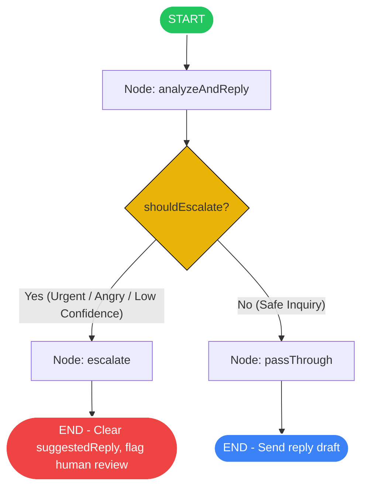
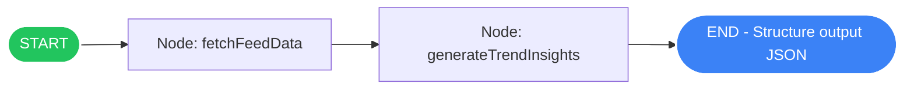

<div align="center">

# 🤖 AgenticPilot

**AI-Powered Business Automation Suite & Social Graph Coordinator**

*Intelligent, autonomous agents running 24/7 to automate business emails, social media content, and product marketing.*

<br>

[](https://github.com/Priyanshu-Debugs/AgenticPilot)

<br>

<!-- Tech Stack Icons -->
<p>
  
</p>

<br>

<!-- Repository Stats -->
[](https://github.com/Priyanshu-Debugs/AgenticPilot/stargazers)
[](https://github.com/Priyanshu-Debugs/AgenticPilot/network/members)
[](https://github.com/Priyanshu-Debugs/AgenticPilot/issues)
[](https://github.com/Priyanshu-Debugs/AgenticPilot/blob/main/LICENSE)

<br>

[**Get Started**](#-quick-start) · [**Features**](#-features) · [**Tech Stack**](#-tech-stack) · [**Architecture**](#-architecture) · [**Database Schema**](#-database-schema) · [**Team**](#-team)

</div>

---

## 📌 Overview

**AgenticPilot** is a production-ready SaaS suite designed to automate time-consuming business processes. Powered by Next.js 15, Supabase, Google's Gemini 3.1 Flash Lite, and LangGraph, it acts as a virtual workforce. It reads incoming customer inquiries, evaluates sentiment, automatically crafts and sends email replies, designs social media schedules, optimizes marketing product photographs, and suggests trendy articles.

```
┌────────────────────────────────────────────────────────────────┐
│                                                                │
│   🎯 TARGET AUDIENCE               💡 PLATFORM BENEFITS        │
│   ───────────────                  ───────────────────         │
│   • Startups & SMBs               • Saves 20+ hours per week  │
│   • E-commerce Brand Owners       • Human-in-the-Loop Safety  │
│   • Digital Marketing Agencies    • 24/7 Autonomous Operation │
│   • Customer Success Teams        • High-accuracy AI matching │
│                                                                │
└────────────────────────────────────────────────────────────────┘
```

---

## ✨ Features

AgenticPilot integrates five core automation pillars:

### ✉️ 1. Gmail Auto-Pilot & Intelligent Escalation
- **Autonomous Scan**: Scans users' Gmail accounts in real-time or via 5-minute cron triggers.
- **LangGraph Classifier**: Evaluates incoming email text for category, sentiment, and urgency in a single LLM execution.
- **Human-in-the-loop Escalation**: Automatically stops and moves emails with negative sentiment, high urgency, or low AI confidence (<70%) to a human review queue.
- **Activity Log**: Provides telemetry charts displaying total processed messages, response times, and success rates.

### 📸 2. AI Product Photography Studio
- **Background Synthesis**: Transforms raw product photos into professional-grade advertising assets.
- **Photography Styles**: Supports five styles: *Studio* (softbox lighting), *Lifestyle* (natural setting), *Flat-lay* (top-down view), *Minimal* (hero shots), and *Dramatic* (dark cinematic).
- **Client-Side Canvas Compositing**: Seamlessly scales and overlays the product image onto the AI-generated background inside the browser, adding ambient drop shadows.
- **AI Content Pack**: Generates corresponding captions, hashtag arrays, and posting tips for the generated photo.

### 📱 3. Instagram Automation Hub
- **Queue Management**: Saves posts as drafts, schedules them, or publishes them directly.
- **AI Caption & Hashtag Graphs**: Runs dedicated single-node LangGraph structures (`captionGraph`, `hashtagGraph`) to generate engaging social copy.
- **Engagement Telemetry**: Displays reach, views, likes, and comments directly in a modern analytics dashboard.

### 💼 4. Omnichannel Publisher (LinkedIn & Twitter/X)
- **LinkedIn Integration**: Exposes OAuth 2.0 connection parameters, registers media urns, uploads image buffers, and posts to user feeds.
- **Tone Profiles**: Supports generating content in five custom styles (*Casual*, *Inspirational*, *Educational*, *Thought-Leadership*, and *Professional*).
- **Twitter Sync**: Seamless callback connections and posting routines.

### 🔍 5. Social Listening Engine
- **Web scraping Node**: Scrapes tag feeds (e.g., dev.to) dynamically using user-provided keywords.
- **Market Intelligence**: Gemini analyzes community sentiments, identifies the "Buzz Score" (0-100), and drafts optimized platform-specific social posts in a single step.

---

## 🛠 Tech Stack

AgenticPilot is built using a modern, type-safe development framework:

| Category | Technologies | Description |
| :--- | :--- | :--- |
| **Framework** | Next.js 15 (App Router) | High-performance React framework with server actions |
| **Language** | TypeScript 5 | End-to-end type safety |
| **UI Rendering** | React 19, Tailwind CSS 4 | Dynamic layouts, utility styling |
| **Animations** | Framer Motion, Anime.js, Three.js | Premium visuals, micro-interactions |
| **Database & Auth** | Supabase (PostgreSQL + RLS) | Real-time listeners, Row-Level Security |
| **AI Framework** | LangGraph & LangChain | Structured workflows and state-graph definitions |
| **Foundation LLM** | Google Gemini 3.1 Flash Lite | Fast inference and high-context capabilities |
| **APIs Integrated** | Google Gmail API, LinkedIn, Twitter | Native OAuth integrations |
| **Validation** | Zod | Robust runtime schemas |

---

## 📁 Project Structure

```
AgenticPilot/
├── app/                              # Next.js App Router Pages & APIs
│   ├── api/                          # Backend API Routes
│   │   ├── auth/                     # Supabase session endpoints
│   │   ├── cron/                     # Automated cron hooks (auto-reply)
│   │   ├── gmail/                    # Gmail analysis, sync, logs, settings
│   │   ├── instagram/                # Social captions and product photo synthesis
│   │   ├── linkedin/                 # Image registry, OAuth callback, posting
│   │   ├── twitter/                  # Twitter OAuth sync
│   │   └── listening/                # Feed retrieval and social mining
│   ├── dashboard/                    # Core Application Dashboard UI
│   │   ├── gmail/                    # Email automation console
│   │   ├── instagram/                # Post logs and Product Photography Studio
│   │   └── listening/                # Trends and content strategy console
│   ├── pricing/                      # Product pricing templates
│   └── about/                        # Team details and founders
├── components/                       # Shared UI and Features components
│   ├── ui/                           # Base design tokens (Radix UI + shadcn)
│   └── shared/                       # Navigation, sidebars, layouts
├── lib/                              # Logic layer
│   ├── ai/                           # AI Client configuration
│   │   └── graphs/                   # State-Graph Agent definitions
│   ├── agents/                       # Listening agent nodes
│   ├── gmail/                        # Gmail OAuth, MIME formatting, and client routines
│   └── linkedin/                     # LinkedIn API helpers (media upload)
├── utils/                            # Shared utilities (Supabase, hooks)
├── middleware.ts                     # Routing authorization checks
└── package.json                      # Dependency manifests
```

---

## 📊 Architecture

### System Flow
AgenticPilot orchestrates the following relationships between the frontend, API routes, database hooks, and external providers:

```
┌───────────────────────────────────────────────────────────────────┐
│                           FRONTEND                                │
│       Next.js App Router / React 19 / Framer Motion / UI Cards    │
└─────────────────────────────────┬─────────────────────────────────┘
                                  │ HTTPS Requests / DB Listeners
                                  ▼
┌───────────────────────────────────────────────────────────────────┐
│                          API LAYER                                │
│          Next.js Route Handlers + Auth Middleware                 │
└───────────┬─────────────────────┬───────────────────┬─────────────┘
            │                     │                   │
            ▼                     ▼                   ▼
┌───────────────────────┐ ┌───────────────┐ ┌───────────────────────┐
│     STATE GRAPHS      │ │   DATABASE    │ │   EXTERNAL SERVICES   │
│   LangGraph Agents    │ │ Supabase (DB) │ │ Gmail (Google API)    │
│   Gemini 1.5 Models   │ │ OAuth Tokens  │ │ LinkedIn (OAuth API)  │
│   Zod Schemas         │ │ RLS Policies  │ │ Twitter (API v2)      │
└───────────────────────┘ └───────────────┘ └───────────────────────┘
```

---

### Core Agent Workflows

#### 1. Gmail Automation & Escalation Graph
Defined in [`email-analysis-graph.ts`](file:///c:/Users/Priyanshu/Documents/AgenticPilot/lib/ai/graphs/email-analysis-graph.ts), this workflow manages structured email evaluations and isolates critical messages:


```mermaid
graph TD
    Start([START]) --> Node1[Node: analyzeAndReply]
    Node1 --> Cond{shouldEscalate?}
    
    Cond -- Yes (Urgent / Angry / Low Confidence) --> NodeEscalate[Node: escalate]
    Cond -- No (Safe Inquiry) --> NodePass[Node: passThrough]
    
    NodeEscalate --> End([END - Clear suggestedReply, flag human review])
    NodePass --> End2([END - Send reply draft])

    style Start fill:#22c55e,stroke:#fff,stroke-width:2px,color:#fff
    style End fill:#ef4444,stroke:#fff,stroke-width:2px,color:#fff
    style End2 fill:#3b82f6,stroke:#fff,stroke-width:2px,color:#fff
    style Cond fill:#eab308,stroke:#000,stroke-width:1px
```

```
[ASCII Flowchart Backup]
Input Email ──▶ [analyzeAndReplyNode] ──▶ [shouldEscalate Check]
                                                    │
                             ┌──────────────────────┴──────────────────────┐
                             ▼ (Confidence <70% / Negative / High Urg)    ▼ (Safe Email)
                      [escalateNode]                                 [passThroughNode]
                             │                                             │
                             ▼                                             ▼
                 Clear Reply & Flag Human Review                       Send Auto-Reply
```

#### 2. Social Listening Agent Graph
Defined in [`listeningAgent.ts`](file:///c:/Users/Priyanshu/Documents/AgenticPilot/lib/agents/listeningAgent.ts), this workflow retrieves internet activity and creates social media drafts:


```mermaid
graph LR
    Start([START]) --> NodeScrape[Node: fetchFeedData]
    NodeScrape --> NodeAnalyze[Node: generateTrendInsights]
    NodeAnalyze --> End([END - Structure output JSON])

    style Start fill:#22c55e,stroke:#fff,stroke-width:2px,color:#fff
    style End fill:#3b82f6,stroke:#fff,stroke-width:2px,color:#fff
```

---

## 💾 Database Schema

AgenticPilot relies on Supabase PostgreSQL tables configured with strict Row-Level Security (RLS) policies:

### `user_profiles`
Maintains user membership tiers and organizational configurations.
- `id` (uuid, primary key)
- `user_id` (uuid, unique index references auth.users)
- `full_name` (text, nullable)
- `avatar_url` (text, nullable)
- `plan` (text: starter, professional, enterprise)
- `company` (text, nullable)
- `bio` (text, nullable)
- `timezone` (text, default 'UTC')
- `created_at` / `updated_at` (timestamptz)

### `gmail_tokens`
Stores OAuth 2.0 verification parameters and auto-reply configurations.
- `user_id` (uuid, primary key references user_profiles.user_id)
- `access_token` (text)
- `refresh_token` (text)
- `expires_at` (timestamptz)
- `auto_reply_enabled` (boolean, default false)
- `human_review_enabled` (boolean, default false)

### `gmail_logs`
Tracks processed activity and API execution times.
- `id` (uuid, primary key)
- `user_id` (uuid references user_profiles.user_id)
- `email_subject` (text)
- `email_from` (text)
- `action` (text: analyzed, replied, skipped, error)
- `confidence` (numeric)
- `response_time_ms` (integer)
- `success` (boolean)
- `created_at` (timestamptz)

### `instagram_posts`
Tracks queue configurations and metrics for published content.
- `id` (uuid, primary key)
- `user_id` (uuid references user_profiles.user_id)
- `image_url` (text, nullable)
- `caption` (text)
- `hashtags` (text array)
- `status` (text: draft, scheduled, posted, failed)
- `engagement_likes` / `engagement_comments` / `engagement_views` (integer, default 0)
- `ai_generated` (boolean, default false)
- `scheduled_time` / `posted_at` (timestamptz)

---

## 🚀 Quick Start

### Prerequisites
- Node.js v18+ or v20+ installed.
- A Supabase project initialized.
- Google Cloud Console access (for Gmail OAuth credentials).
- Google AI Studio key (for Gemini models access).

### 1. Installation
```bash
# Clone the repository
git clone https://github.com/Priyanshu-Debugs/AgenticPilot.git
cd AgenticPilot

# Install dependencies
npm install
```

### 2. Environment Variables Configuration
Copy `.env.example` to `.env.local`:
```bash
cp .env.example .env.local
```

Populate the keys in `.env.local`:
```env
# Supabase Connectivity
NEXT_PUBLIC_SUPABASE_URL=https://your-project.supabase.co
NEXT_PUBLIC_SUPABASE_ANON_KEY=your-anon-key
SUPABASE_SERVICE_ROLE_KEY=your-service-role-key

# App Deploy URL
NEXT_PUBLIC_SITE_URL=http://localhost:3000

# Google Cloud OAuth API Credentials (for Gmail API Integration)
GOOGLE_CLIENT_ID=your-google-client-id.apps.googleusercontent.com
GOOGLE_CLIENT_SECRET=your-google-client-secret

# Google Gemini API Keys (for LLM State Graphs)
GOOGLE_AI_API_KEY=AIzaSy...

# Optional Integrations
LINKEDIN_CLIENT_ID=your-linkedin-client-id
LINKEDIN_CLIENT_SECRET=your-linkedin-client-secret
TWITTER_CLIENT_ID=your-twitter-client-id
TWITTER_CLIENT_SECRET=your-twitter-client-secret
```

### 3. Run Development Server
```bash
npm run dev
```
Open [http://localhost:3000](http://localhost:3000) to view the application.

---

## ⚙️ Integrations & APIs Setup

### Supabase Settings
1. Create a project in [Supabase Dashboard](https://supabase.com).
2. Create the tables (`user_profiles`, `gmail_tokens`, `gmail_logs`, `instagram_posts`, `instagram_settings`, `linkedin_connections`, `linkedin_posts`, `notifications`) matching the schema descriptions.
3. Enable Row-Level Security (RLS) on all tables and create policies checking `auth.uid() = user_id`.

### Google Cloud Developer Setup
1. Go to the [Google Cloud Console](https://console.cloud.google.com).
2. Create a project and enable the **Gmail API**.
3. In the OAuth consent screen tab, set the User Type to External and add the scopes:
   - `https://www.googleapis.com/auth/gmail.readonly`
   - `https://www.googleapis.com/auth/gmail.send`
   - `https://www.googleapis.com/auth/gmail.modify`
4. Create an **OAuth client ID** credential with application type Web Application.
5. Add Authorized Redirect URIs:
   - `http://localhost:3000/api/gmail/callback` (Local development)
   - `https://your-production-domain.com/api/gmail/callback` (Production)

### Google Gemini AI Studio
1. Navigate to [Google AI Studio](https://aistudio.google.com/).
2. Create an API Key and assign it to the `GOOGLE_AI_API_KEY` environment variable.

---

## 🔐 Security Protocols

AgenticPilot enforces multi-layer security protections:
1. **Supabase Row Level Security (RLS)**: Blocks cross-tenant data requests. Users can only query rows associated with their authentication UID.
2. **Encrypted Tokens**: Access tokens are kept secure, and expiration times are tracked to trigger automatic token refresh loops before executing API actions.
3. **Strict Validation**: All API request bodies are parsed using `zod` schemas.
4. **Human Review Queue**: Prevents automated systems from responding to high-risk client complaints, keeping business communication safe.

---

## 👥 Collaborators

AgenticPilot was designed and built by a group of college friends pursuing their Computer Engineering degree at **VGEC (Vishwakarma Government Engineering College)**.

<div align="center">

| Profile | Member | Core Role | Focus Area |
| :---: | :--- | :--- | :--- |
|  | **Priyaanshu Patel**<br>[@Priyanshu-Debugs](https://github.com/Priyanshu-Debugs) | Co-Founder & Developer | AI/ML Engineer |
|  | **Mihir Patel**<br>[@mihirpatel204](https://github.com/mihirpatel204) | Co-Founder & Developer | AI/ML Engineer |
|  | **Sujal Patel**<br>[@sujal7122005](https://github.com/sujal7122005) | Co-Founder & Developer | Full Stack Developer |

<br>

[](https://github.com/Priyanshu-Debugs/AgenticPilot/graphs/contributors)

</div>

---

## 🤝 Contributing

We welcome contributions to AgenticPilot! Please follow these guidelines:

1. **Fork** the repository and create your feature branch:
   ```bash
   git checkout -b feature/your-feature-name
   ```
2. Commit message prefixes:
   - `feat:` for new features
   - `fix:` for bug fixes
   - `docs:` for documentation updates
   - `refactor:` for refactoring code
   - `chore:` for build system/maintenance updates
3. Push to your branch:
   ```bash
   git push origin feature/your-feature-name
   ```
4. Create a **Pull Request** explaining your changes.

---

## 📄 License

This project is licensed under the Apache 2.0 License - see the [LICENSE](LICENSE) file for details.

---

<div align="center">

**If you find this project helpful, please give it a ⭐ on GitHub!**

[Report Bug](https://github.com/Priyanshu-Debugs/AgenticPilot/issues) · [Request Feature](https://github.com/Priyanshu-Debugs/AgenticPilot/issues)

</div>
